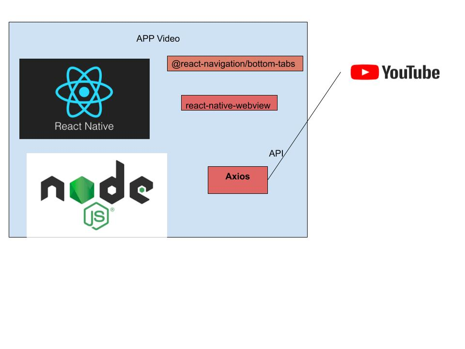

# video

app de stremer de videos

**Objetivos**

 Construir um app para organizar vídeos relacionados a área da programação

**Justificativa**

Atividade avaliativa 

**tecnologias**

- React Native
-JavaScript

**API**

- [YouTube](https://www.googleapis.com/youtube/v3)

**Frameworks**

- Expo
- Axios

**Comandos**

- Instalar o Expo-cli:
  npm install -g expo-cli

- Inicializar uma aplicação
  expo init name_project

- Instalar dependências
  npm install

- Start na aplicação
  npm start

  

**Arquitetura**

